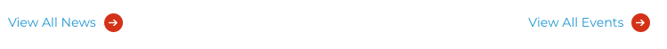
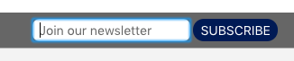
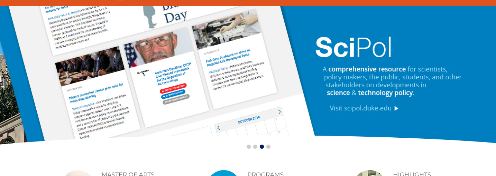
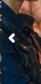

<style>
img {
	max-width:99%;
}
a {
  color: blue;
}
pre {
  font: inherit;
  word-wrap: break-word;
  background: none;
  border: none;
}
code {
  font-size: 10px;
}
</style>

# Scienceandsociety.duke.edu/ Assessment 

__<https://scienceandsociety.duke.edu/>__

__Screenshot 06/08/2018:__


Thank you for your interest in improving the accessibility of Scienceand society.duke.edu. 

The assessment includes the homepage, landing page representative, and the contact form. The homepage assessment includes global elements such as navigation and search. Those global elements are not repeated in the other documents. When they are fixed on the homepage it should naturally propagate to the subpages. 

If you need any assistance in understanding the issues or performing the fixes please reach out to us at web-accessibility@duke.edu or 919-613-4811. We may be able to come to you to assist with the remediation. The services provided by the Web Accessibility Team are free to Duke websites.

<details>
<summary>__Table of Contents__</summary>

[toc]

</details>

<br>
<hr>
<br>
<br>
<hr>
<br>


## Links have no :hover states

Links require hover states so people can tell if they are hovering over a link or not.

### Trending new stories [priority]
Missing hover state.

#### Visual location:


#### CSS location:

Near line 1100 in styles.css

```css
#home-events h3 a,
#trending-news h3 a {
  text-decoration: none;
  color: #001b62;
}
```

#### Suggested solution:

There are a few ways to fix this. The easiest way is to add an underline on hover.

Place after to CSS mentioned above./

```css
#home-events h3 a:hover
#home-events h3 a:focus,
#trending-news h3 a:hover,
#trending-news h3 a:focus {
  text-decoration: underline;
}
```
<br>
<hr>


### View All links [priority]
Missing hover state.

#### Visual location:



#### CSS location:

```css
a.all-events:hover {
  
  background-image: url(images/blue-arrow-button.png);
}
```

#### Suggested solution:

Near line 2639 in style.css add text decoration underline.

```css
a.all-events:hover {
  text-decoration:underline;
  background-image: url(images/blue-arrow-button.png);
}
```
__[Please view Gist](https://gist.github.com/jhc36-duke-edu/1bb360235dd6b21386c30aa1b4128e68/revisions)__

<br>
<hr>
<br>
<br>
<hr>
<br>


## Some background and foreground colors do not have a sufficient contrast ratio.
Low-contrast text is difficult or impossible for many users to read. [Learn more](https://dequeuniversity.com/rules/axe/2.2/color-contrast?application=lighthouse).

### The main navigation links <em>Education, Engagment, Research, About us</em> have low contrast. [priority]

#### Visual location:


#### HTML location:

```html
<nav id="nav" role="navigation">
  <ul>
    <li class="">
      <a href="https://scienceandsociety.duke.edu/learn">Education</a>
    <li>
    <li class="">
        <a href="https://scienceandsociety.duke.edu/engage">Engagement</a>
  </li>
    <li class="">
        <a href="https://scienceandsociety.duke.edu/research">Research</a>
    </li>
    <li class="">
      <a href="https://scienceandsociety.duke.edu/about-us">About&nbsp;Us</a>
    </li>
  <ul>
</nav>
```

#### Suggested solution:

Fix any of the following:
Element has insufficient color contrast of 4.07 (foreground color: #ffffff, background color: #d75404, font size: 12.8pt, font weight: normal). Expected contrast ratio of 4.5:1

If the font-size is increased to 17px the contrast ratio only needs to meet a 3:1 ratio.

Using the following selector, it can change the size of the four links without interfering with the sub-navigation or the layout in any way.

```css
#landing-header span a, 
#ma-description h4 a, 
#ma-header h4 a {
  font-size: 17px;
}

```
<br>

<hr>

### The "<em>People, News, Events, Contact Us</em>", footer links have low contrast. [priority]

#### Visual location:


#### HTML location:

```html
<a href="https://scienceandsociety.duke.edu/about-us/people/">People</a>
```

#### Suggested solution:

Fix any of the following:
  Element has insufficient color contrast of 3.57 (foreground color: #cccccc, background color: #666666, font size: 10.5pt, font weight: normal). Expected contrast ratio of 4.5:1`
  
Change: [#CCCCCC/#666666](https://webaim.org/resources/contrastchecker/?fcolor=CCCCCC&bcolor=666666)

To: [#E6E6E6/#666666](https://webaim.org/resources/contrastchecker/?fcolor=E6E6E6&bcolor=666666)

In the generaged styles.css near line 3246 change #CCCCCC to #e6e6e6e;

```css 
#footer-nav ul li a {
  font-family: 'Montserrat', sans-serif;
  color: #e6e6e6e; /* new color */
  font-size: 1em;
  text-transform: uppercase;
  text-decoration: none;
  font-weight: normal;
}
```
__[Please view Gist](https://gist.github.com/jhc36-duke-edu/86771057f0851cc99be64a72572b1554/revisions)__


<details>
<summary>_Additional debugging details_</summary>

_Selector path:_ <br>
`[u'#menu-item-3289 > a[href$="____/"]']`

_DOM path:_ <br>
`1,HTML,1,BODY,25,DIV,0,DIV,0,DIV,0,DIV,0,UL,0,LI,0,A`
</details>

<hr>
<br>
<br>
<hr>


## Text in images

Screen readers cannot read text inside an image. They rely on the alt attribute text.

WCAG [Images of Text](https://www.w3.org/TR/UNDERSTANDING-WCAG20/visual-audio-contrast-text-presentation.html) Success Criteia states that text should only be used in images unless it is "[essential](https://www.w3.org/TR/UNDERSTANDING-WCAG20/visual-audio-contrast-text-presentation.html#key-terms)". Admittedly that is not very specific. 

Here is some informal advice that is more black-and-white:

1. If all the text in the image can not be distiled into the alt attribute it fails the WCAG, without question.
2. If there are more than 8 words in an image, its probably too many words, and we won't be able to defend that images use if a complaint is made.

### The alt text in all four slider images is incomlete or inadequate [priority]

### SciPol slide example:


#### Alt text is not accurate:
Current alt text is "scipol". That alt text does not accurately or fully describe the text in the image, depriving the screen reader user of important information.

#### Too many words:
This is just too many words to put in an alt tag.  This image is also a link, since there is no text in the `<a>` link the alt text is the only context that would be read to a screen reader. Link text needs to describe what the link does and indicate where it will take the user.

#### Text in image has low contrast:

Automated tests cannot detect contrast ratios of text in images.  The text in this slide requires a 3:1 contrast ratio.

Using the [Color Contrast Analyzer](https://chrome.google.com/webstore/detail/color-contrast-analyzer/dagdlcijhfbmgkjokkjicnnfimlebcll?hl=en) tool we can run tests to help determine if the contrast ratio is adequate.


Text that has no outline does not meet the minimum contrast ratio.

#### Possible solution options and advice:

1. Optionally, Use a real text overlay instead of text in an image.
2. Use less words in the image.
3. Add more accurate alt text.
4. Increase the contrast of the text against the background image or add a dropshadow.

<br>
<hr>
<br>
<br>
<hr>

## Some `[id]` attributes on the page are not unique
The value of an id attribute must be unique to prevent other instances from being overlooked by assistive technologies. [Learn more](https://dequeuniversity.com/rules/axe/2.2/duplicate-id?application=lighthouse).


#### Suggested solution:

1. Check if the page needs that ID for CSS for visual reasons.
2. Check if the page needs that ID for JS for interactive behaviours.
3. If it needs the IDs edit the dependent code, then remove duplicate IDs from the HTML.


#### HTML location:

##### \#wrapper x 3

```html
<div id="wrapper"></div>
```

<details>
<summary>_Additional debugging details_</summary>

_Selector path:_ <br> `[u'#header > div:nth-child(1)']`

_DOM path:_ <br>
`1,HTML,1,BODY,8,DIV,0,DIV`
</details>

##### \#clear x 14

```html
<div id="clear"></div>
```
<details>
<summary>_Additional debugging details_</summary>

_Selector path:_ <br> `[u'#form1 > div:nth-child(3)']`

_DOM path:_ <br>
`1,HTML,1,BODY,8,DIV,0,DIV,5,DIV,0,FORM,2,DIV`
</details>

##### \#updown x 2 & \#up x 2 & \#down x 2 

```html
<div id="updown">
   <a id="up" class="news-up">Up</a>
   <a id="down" class="news-down">Down</a>
</div>
```

<details>
<summary>_Additional debugging details_</summary>

_Selector path:_ <br> `[u'div:nth-child(1) > a.news-up']`

_DOM path:_ <br>
`1,HTML,1,BODY,12,DIV,1,DIV,0,DIV,0,DIV,0,A`
</details>

##### \#listed-thumbs x 6

```html 
<div id="listed-thumbs"></div>
```

<details>
<summary>_Additional debugging details_</summary>

_Selector path:_ <br> `[u'#trending-news > div:nth-child(1)']`

_DOM path:_ <br>
`1,HTML,1,BODY,12,DIV,1,DIV,0,DIV,0,DIV`
</details>

<hr>

<br>
<br>
<hr>

## Some form elements do not have associated labels
Labels ensure that form controls are announced properly by assistive technologies, like screen readers. [Learn more](https://dequeuniversity.com/rules/axe/2.2/label?application=lighthouse).


### Form field missing label: [priority]<br>

#### Visual location:


#### HTML location:

```html
<input type="email" value="" name="EMAIL" class="required email" id="mce-EMAIL" placeholder="Join our newsletter">
```

#### Suggested solution:

Add a label and associate it with the form field. Optionally it can be visually hidden so it does not effect the layout. Using the .visually-hidden utility class.

Add this HTML:

```html
<label for="mce-EMAIL" class="visually-hidden">Subscribe to our newsletter</label>` to associate the label with that form field.
```

__[Please view Gist](https://gist.github.com/jhc36-duke-edu/67dcfccab86b2b8eb318233afadb1b85/revisions)__

Add this CSS to hide the label visually, but keep it availible to screen readers.

```css
.visually-hidden {
    position: absolute !important;
    height: 1px; width: 1px; 
    overflow: hidden;
    clip: rect(1px, 1px, 1px, 1px);
}
```

<sub>For more options see 'Additional debugging details' below.</sub>

<details>
<summary>_Additional debugging details_</summary>

_Selector path:_ <br> `[u'#mce-EMAIL']`
`[u'#mce-EMAIL']`

_DOM path:_ <br>
`1,HTML,1,BODY,25,DIV,0,DIV,2,DIV,0,FORM,0,DIV,0,DIV,0,INPUT`

_Summary:_ <br>
  <pre>Fix any of the following:
  aria-label attribute does not exist or is empty
  aria-labelledby attribute does not exist, references elements that do not exist or references elements that are empty or not visible
  Form element does not have an implicit (wrapped) <label>
  Form element does not have an explicit <label>
  Element has no title attribute or the title attribute is empty
  </pre>
</details>
<hr>


<br>
<br>
<hr>
## Some links do not have a discernible name
Link text (and alternate text for images, when used as links) that is discernible, unique, and focusable improves the navigation experience for screen reader users. [Learn more](https://dequeuniversity.com/rules/axe/2.2/link-name?application=lighthouse).

### Logo is missing alt text [priority]

#### Visual location:


#### HTML location:

```html
<a href="https://scienceandsociety.duke.edu/">
  
</a>
```
#### Suggested solution:

Adding `alt` attribute to image element will provide sufficient text to make the link accessible.

Since this is the header logo that takes people back to the home page, a good alt tag would be `alt="Science and Society Home"`.

<br>

<details>
<summary>_Additional debugging details_</summary>

_Selector path:_ <br> `[u'#logo > a']`

_DOM path:_ <br>
`1,HTML,1,BODY,8,DIV,0,DIV,0,DIV,0,A`

_Summary:_ <br>
  <pre>Fix all of the following:
  Element is in tab order and does not have accessible text

Fix any of the following:
  Element does not have text that is visible to screen readers
  aria-label attribute does not exist or is empty
  aria-labelledby attribute does not exist, references elements that do not exist or references elements that are empty or not visible
  Element's default semantics were not overridden with role="presentation"
  Element's default semantics were not overridden with role="none"
  </pre>
</details>
<br>
<hr>
<br>
<br>
<hr>


## Multiple issues with each News Entry x 5 [priority]


#### Visual location:


#### HTML location:

```html
<li class="news_entry">
   ...
</li>
```
#### Suggested solution:

There are multiple issues with this template.  
	1. Empty alt tag<br>
	2. Using `<div id='clear'></div>` multiple times. ID's are required to be unique. This is both required to make the HTML validate as well as making the site compatible with assistive technologies. After some testing, it looks like this `<div>` serves no purpose anyway. It can just be deleted<br>
	3. Stray empty `<a>` tag, which can also be deleted.<br>


__[Please see Gist for details on what to fix on all the issues](https://gist.github.com/jhc36-duke-edu/ab4e77831b50ebdc4e51411ec1462922/revisions)__


<details>
<summary>__Additional debugging details__</summary>

_Selector path:_ <br> `[u'#pane-target > ul > li:nth-child(3) > div:nth-child(2) > p > a']`

_DOM path:_ <br>
`1,HTML,1,BODY,12,DIV,1,DIV,0,DIV,2,DIV,0,UL,2,LI,1,DIV,1,P,1,A`

_Summary:_ <br>
  <pre>
Fix all of the following:
  Element is in tab order and does not have accessible text

Fix any of the following:
  Element does not have text that is visible to screen readers
  aria-label attribute does not exist or is empty
  aria-labelledby attribute does not exist, references elements that do not exist or references elements that are empty or not visible
  Element's default semantics were not overridden with role="presentation"
  Element's default semantics were not overridden with role="none"
  </pre>
</details>
<br>
<hr>
<br>
<br>
<hr>

## `[user-scalable="no"]` is used in the `<meta name="viewport">` element or the `[maximum-scale]` attribute is less than 5.


Disabling zooming is problematic for users with low vision who rely on screen magnification to properly see the contents of a web page. [Learn more](https://dequeuniversity.com/rules/axe/2.2/meta-viewport?application=lighthouse).

#### HTML location:

```html
<head>
...
  <meta name="viewport" content="width=device-width, initial-scale=1.0, maximum-scale=1.0">
...
</head>
```

#### Suggested Solution

Change maximum-scale attribute to 5.

```html
<meta name="viewport" content="width=device-width, initial-scale=1, maximum-scale=5">
```
<br>
<hr>
<br>
<br>
<hr>

## Some Interactive controls are not keyboard focusable
Custom interactive controls are keyboard focusable and display a focus indicator. [Learn more](https://developers.google.com/web/fundamentals/accessibility/how-to-review#start_with_the_keyboard).
<br>
### Search box not keyboard accessible [priority]

Keyboard accessible Search is particularly important. Some keyboard users use search as thier primary method to find content on websites becasuse it can be easier than navigating the whole site. Also, if a keyboard user gives up navigating the website for some reason, search may be thier final resort to find information.

#### Visual location:


#### HTML location:

```html
<div id="search-div" style="display: block;"> 
  ...
</div>   
```

Innaccessible JS behavior

```js

$('document').ready(function() {

  $('#show1').click(function() {

    $('#search-div').slideToggle(400, function() {
      if ($('#search-div').is(':visible')) {
        $('#search2').focus();
      }
    });
  });
});
```

#### Suggested solution:

1) On trigger element and the target element, remove the following attributes:<br>
 `class='fade'` <br>
 `style="opacity: 0"`<br>
Those attibutes and the related Javascript is wreaking havoc on keyboard accessibility and visibility.

2) Update the current search toggle HTML with this code

```html
<li>
	<a href="#search-div" id="show1" aria-role="button" aria-controls="search-div" aria-expanded="true" aria-haspopup="true">
		
	</a>
</li>
```
__[Please see Gist](https://gist.github.com/jhc36-duke-edu/71326bd0d14ddac6ed6ae36606268d6a/revisions)__

3) Replace the old javascript located in the `<head>` of the HTML that was controling the search toggle behavior with this accessible version:

```js
$(document).ready(function() {
	$('#show1').click(function () {
		toggle('search-div', 'show1');
		return false
	});
	function toggle(id, id2) {
		var n = document.getElementById(id);
		if (n.style.display != 'none') {
			n.style.display = 'none';
			document.getElementById(id2).setAttribute('aria-expanded', 'false');
			document.getElementById(id).setAttribute('aria-hidden', 'true');
		} else {
			n.style.display = 'block';
			document.getElementById(id2).setAttribute('aria-expanded', 'true');
			document.getElementById(id).setAttribute('aria-hidden', 'false');
		}
	}
});
```
__[Please view Gist](https://gist.github.com/jhc36-duke-edu/5fa7e63cdf43df7a9c47966296030529/revisions)__

<br>
<hr>
<br>

### Main featured action items not focusable or keyboard accessibile

#### Visual location:


#### HTML location:

```html
<div id="features">
  <div id="ma-feature" class="pin" onclick="window.open('ma', '_self')" style="cursor:pointer;" tabindex="0">
    ...
  </div>
  <div id="calendar-feature" class="pin" onclick="window.open('https://scienceandsociety.duke.edu/learn/duke-scipol-summer-institute/', '_self')" style="cursor:pointer;">
    ...
  </div>		
  <div id="news-feature" class="pin" onclick="window.open('https://scienceandsociety.duke.edu/learn/undergraduate-programs/reimagining-medicine/', '_self')" style="cursor:pointer;">
    ...
  </div>		
</div>
```
#### Suggested solution:

There is no reason compelling reason for these elements not to be a normal `<a>` link. It greatly simplifies the markup and will fix multiple accessibilty problems in the process.

```html
<div id="features">
  <a id="ma-feature" class="pin" href="/learn/ma/">
    ...
  </a>
  <a id="calendar-feature" class="pin" href="/learn/duke-scipol-summer-institute/">
    ...
  </a>		
  <a id="news-feature" class="pin" href="/learn/undergraduate-programs/reimagining-medicine">
    ...
  </a>		
</div>
```

__[Please view Gist](https://gist.github.com/jhc36-duke-edu/92dfc8a1ced02c1c6c21bab288a65b94/revisions)__


<br>
<hr>
<br>
<br>
<hr>
<br>

## The user's focus is not directed to new content added to the page
If new content, such as a dialog, is added to the page, the user's focus is directed to it. [Learn more](https://developers.google.com/web/fundamentals/accessibility/how-to-review#start_with_the_keyboard).

### Search box toggle
This will be fixed by implementing the search fix above.

### Main navigation sub-menu
Ideally, the main navigation should be expanable via the keyboard also, but since all the links are also availible on thier landing pages, it technically passes.  But adding some very basic keyboard functionality is a simple cut-paste job.  The following JS will expand the selected item's sub-navigation when a user hits the down arrow.

### Suggested Solution:

Add this JS inside any existing or new document.ready:

```js
$('#nav > ul > li').on('focus', '> a', function(e) {
  $this = jQuery(this);

  $this.attr('aria-haspopup', 'true').attr('aria-expanded', 'false');
  $this.parent().find('> ul').css('display', 'none').css('visibility', 'hidden');

  $this.keydown(function(e) {
      if (e.keyCode === 40) {
	      jQuery(this).attr('aria-expanded', 'true');
          jQuery(this).parent().find('> ul').css('display', 'block').css('visibility', 'visible').attr('aria-hidden', 'false');
          return false;
      }
      if (e.keyCode === 38) {
	      jQuery(this).attr('aria-expanded', 'false');
          jQuery(this).parent().find('> ul').css('display', 'none').css('visibility', 'hidden').attr('aria-hidden', 'true');
          return false;
      }
  });
});
```

<br>
<hr>
<br>
<br>
<hr>
<br>

## HTML5 landmark elements are not used to improve navigation
Landmark elements (`<main>`, `<nav>`, etc.) are used to improve the keyboard navigation of the page for assistive technology. [Learn more](https://developers.google.com/web/fundamentals/accessibility/how-to-review#take_advantage_of_headings_and_landmarks).

### Main content are and footer

#### Suggested Solution:
Add an element to wrap the content area. Currently there is none, it will need added because the main area should all be in one.

Add a `<main>` element to wrap all content area's `<div>` elements under one element.

Change the Footer's elment from `<div>`:

```html
<div id="footer">
  ...
</div>
```

to `<footer>`:

```html
<footer id="footer">
  ...
</footer>
```

<br>
<hr>
<br>
<br>
<hr>
<br>

## Console Errors

Content must be robust enough that it can be interpreted reliably by a wide variety of user agents, including assistive technologies.

<pre style="color:darkred">
(index):47 Mixed Content: The page at 'https://scienceandsociety.duke.edu/' was loaded over HTTPS, but requested an insecure stylesheet 'http://fonts.googleapis.com/css?family=Oswald%3A400%2C300%7COpen+Sans%3A400%2C300&ver=4.9.5'. This request has been blocked; the content must be served over HTTPS.
</pre>

<pre style="color:darkred">
(index):891 Uncaught TypeError: Cannot read property 'left' of undefined
    at HTMLDocument.<anonymous> ((index):891)
    at l (jquery.min.js:2)
    at Object.fireWith [as resolveWith] (jquery.min.js:2)
    at Function.ready (jquery.min.js:2)
    at HTMLDocument.A (jquery.min.js:2)
(anonymous) @ (index):891
l @ jquery.min.js:2
fireWith @ jquery.min.js:2
ready @ jquery.min.js:2
A @ jquery.min.js:2
</pre>
      
<br>
<hr>
<br>
<br>
<hr>
<br>
## The page does not contain a functional skip link.
Adding ways to bypass repetitive content lets keyboard users navigate the page more efficiently. [Learn more](https://dequeuniversity.com/rules/axe/2.2/bypass).

### Problem: 
Missing bypass block for keyboard users to skip over the menu area when tabbing through a page.

#### Suggested Solution:
Add a skip-to link bypass block.

The skip-to bypass block needs to be the first link on the page. When a user hits the tab key it gives it focus and as a result becomes visible. If the user hits the enter key while it is focused it will jump to the main content area.

HTML:

Trigger is the first link in the <body> element

```html
<div id="skip-link">
    <a href="#main-content" class="element-invisible element-focusable">Skip to main content</a>
</div>
```

Target is added above the main content.
```html
<a id="main-content"></a>
```

CSS:
This css may already be available in the theme, If not, please add:

```css
.element-invisible {
    margin: 0;
    padding: 0;
    width: 1px;
    position: absolute !important;
    clip: rect(1px 1px 1px 1px);
    clip: rect(1px,1px,1px,1px);
    overflow: hidden;
    height: 1px;
}
.element-invisible.element-focusable:active, .element-invisible.element-focusable:focus {
    position: static !important;
    clip: auto;
    overflow: visible;
    height: auto;
}
```

__[Please Watch video](https://drive.google.com/open?id=0B_l64ZEIjqnlal9vcGcwck1YVW8)__

<br>
<hr>
<br>
<br>
<hr>
<br>


## The slideshow carousel is not keyboard or screen reader accessible [priority]
Inaccessible Carousels are the  most difficult and most time consuming issue on any website. 

Keyboard accessibility is one of the most important aspects of web accessibility. Many users with motor disabilities rely on a keyboard. Blind users also typically use a keyboard for navigation. Some people have tremors which don't allow for fine muscle control. [Learn more](https://webaim.org/techniques/keyboard/)

### Problem:
This site uses the Wordpress implementation of Soliloquy. It is not accessible for a variety of reasons detailed below.

#### Visual location:



### What makes a carousel accessible?

* Users must be able to pause carousel movement because it can be too fast or distracting, making text hard to read.
* All functionality, including navigating between carousel items, must be operable by keyboard.
* Changes to carousel items must be communicated to all users, including screen reader users.
* The keyboard position (“focus”) is managed in a reasonable and comprehensible fashion.
* Note: Carousels are disputed from a usability perspective because their content can be hard to discover. Ensuring accessibility can also improve usability.

### Why is this important?
Typically, carousels are prominently located and are used to provide navigation or show page content. Accessible carousels are essential for many website users including:

* People using keyboard navigation and voice input software can navigate between individual items.
* People using screen readers will understand which item is currently shown and how to navigate between items.
* People who are distracted by movement can pause animations.
* People who need more time to read can pause animations, providing them with sufficient time to read and understand carousel content.


#### _My Advice_

Because of the inherit usability and accessibility issues all slideshow provide, I always recommend removing them. This can probably be accomplished by having only one slide in the rotator.

That said, if people must keep the slideshow here are a few easy things you can to to help mitigate the issues.


### 1) Missing pause button. 
For full compliance Carousels are not allowed to auto-advance. 

If the website chooses to keep the autoadvance functionality, it must have a pause button. 

#### Suggested solution:
This might be possible by changing the slideshows configuration. I expect that there would be some CSS necessary to place it. Documentation on this can be found on [Configuring Your Slide](https://soliloquywp.com/docs/configuring-your-slider/) See "Show Pause/Play Controls"

### 2) Controls can not be hidden. 
Currently the user must hover over the carousel to see the next and back buttons/links with a mouse. Some people cannot use a mouse, so they would never know they could control it. They need to be visible at all times.

#### Visual location:
;


#### Suggested solution: 

Add the following CSS to any stylesheet to make the next and back arrow visible at all times.

```css
.soliloquy-outer-container .soliloquy-theme-classic .soliloquy-controls-direction {
  display: block;
}
```

### 3) Controls not keyboard accessible. 
 `outline:none` is used on the elements which hides the keyboard focus indicator. If the keyboard focus indicator is hidden, its not keyboard accessible.
 
#### Suggested solution:

Add the following CSS to any stylesheet to make the next and back arrow visible at all times.

```css
.soliloquy-outer-container .soliloquy-container a:focus {
    outline: auto 2px Highlight;
    outline: auto 5px -webkit-focus-ring-color;
}
```

Expected result when element has keyboard focus:


<br>
<hr>
<br>
<br>
<hr>
<br>

## DOCTYPE declaration is invalid [priority]

The DOCTYPE declaration must be the very first thing in your HTML document, before the `<html>` tag.

#### The site does not have a valid DOCTYPE

Current HTML

```html
<!DOCTYPE>
```

#### Only solution:

```html
<!DOCTYPE html>
```

A valid DOCTYPE declaration is requried to validate the code:

<https://validator.w3.org/check?uri=https%3A%2F%2Fscienceandsociety.duke.edu%2Flearn%2Fma%2F&charset=%28detect+automatically%29&doctype=Inline&group=0&verbose=1&user-agent=W3C_Validator%2F1.3+http%3A%2F%2Fvalidator.w3.org%2Fservices>

After it is fixed, the website developer should look through the errors.
