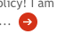

<style>
img {
	max-width:99%;
}
a {
  color: blue;
}
pre {
  font: inherit;
  word-wrap: break-word;
  background: none;
  border: none;
}
code {
  font-size: 10px;
}
</style>

# Scienceandsociety.duke.edu/learn/ma/ Assessment

__<https://scienceandsociety.duke.edu/learn/ma/>__

__Screenshot 06/07/2018:__


## Background and foreground colors do not have a sufficient contrast ratio.
Low-contrast text is difficult or impossible for many users to read. [Learn more](https://dequeuniversity.com/rules/axe/2.2/color-contrast?application=lighthouse).


### Main navigatoin links

#### Visual location:


#### HTML location:

```html
<span>
  <a href="https://scienceandsociety.duke.edu/learn/ma/admissions/ma-info-session/">Online Info Session</a> 
  <a class="apply" href="https://scienceandsociety.duke.edu/learn/ma/admissions/">Who Should Apply?</a>
</span>
```

#### Suggested solution:

Fix any of the following:
Element has insufficient color contrast of 4.07 (foreground color: #ffffff, background color: #d75404, font size: 12.8pt, font weight: normal). Expected contrast ratio of 4.5:1

If the font-size is increased to 17px the contrast ratio only needs to meet a 3:1 ratio.

Using the following selector, it can change the size of the two button links without interfering with layout in any way. It will also repair few more contrast errors elsewhere in the site that are using the same color.

<br>
<hr>
<br>
<br>
<hr>
<br>

## `[id]` attributes on the page are not unique
The value of an id attribute must be unique to prevent other instances from being overlooked by assistive technologies. [Learn more](https://dequeuniversity.com/rules/axe/2.2/duplicate-id?application=lighthouse).


### Landing-box area features x 6

####Visual location:


####HTML location:

```html
<div id="landing-areas">
  <ul>
    <li id="landing-box">
    <li id="landing-box">
    <li id="landing-box">
    <li id="landing-box">
    <li id="landing-box">
    <li id="landing-box">
    <div id="clear">
  </ul>
</div>
```

####Suggested solution:

1. Check if the page needs that ID for CSS for visual reasons.
2. Check if the page needs that ID for JS for interactive behaviours.
3. If it needs the IDs edit the dependent code, then remove duplicate IDs from the HTML.

Also remove the invalid `<div>` nested in the `<ul>`.

<details>
<summary>__Additional debugging details__</summary>

_Selector path:_ <br> `[u'#landing-areas > ul > li:nth-child(1)']`

_DOM path:_ <br>
`1,HTML,1,BODY,12,DIV,0,DIV,0,UL,0,LI`
</details>

<hr>

### Landing-box area features image wrapper x 6

####Visual location:


####HTML location:

```html
<div id="landing-circle-photo">
```

```html
<div id="landing-circle-photo">
```

```html
<div id="landing-circle-photo">
```

```html
<div id="landing-circle-photo">
```

```html
<div id="landing-circle-photo">
```

```html
<div id="landing-circle-photo">
```
####Suggested solution:

1. Check if the page needs that ID for CSS for visual reasons.
2. Check if the page needs that ID for JS for interactive behaviours.
3. If it needs the IDs edit the dependent code, then remove duplicate IDs from the HTML.

<details>
<summary>__Additional debugging details__</summary>

_Selector path:_ <br> `[u'#landing-areas > ul > li:nth-child(1) > div']`

_DOM path:_ <br>
`1,HTML,1,BODY,12,DIV,0,DIV,0,UL,0,LI,0,DIV`
</details>

<br>
<hr>
<br>
<br>
<hr>
<br>

## Links do not have a discernible name
Link text (and alternate text for images, when used as links) that is discernible, unique, and focusable improves the navigation experience for screen reader users. [Learn more](https://dequeuniversity.com/rules/axe/2.2/link-name?application=lighthouse).

### Landing box area feature arrows x 6

#### Visual location:



#### HTML location:

```html
<a href="https://scienceandsociety.duke.edu/learn/ma/ma-welcome/"></a>
```

#### Suggested solution:

It could be deleted. There are already links to those pages right above this link. however, at the moment they lack hover states. So it is possible people would not know they are clickable.

Or

Add some screen reader only text.

```html
<a href="https://scienceandsociety.duke.edu/learn/ma/ma-welcome/">
  <span class="element-invisible">
    MA WELCOME program
  </span>
</a>
```

The text would need to be contextual to match the title. 

The styles for class `.element-invisible` come from a homepage fix and should already be in the CSS to use here.

__[Please view Gist](https://gist.github.com/jhc36-duke-edu/72c6565a83ea91b3f7ddd0bcb2cb7314/revisions)__

<br>

<details>
<summary>__Additional debugging details__</summary>

_Selector path:_ <br> `[u'#landing-areas > ul > li:nth-child(1) > div > a[href$="ma-welcome/"]']`

_DOM path:_ <br>
`1,HTML,1,BODY,12,DIV,0,DIV,0,UL,0,LI,0,DIV,0,A`

_Summary:_ <br>
Fix all of the following:
  Element is in tab order and does not have accessible text

Fix any of the following:
  Element does not have text that is visible to screen readers
  aria-label attribute does not exist or is empty
  aria-labelledby attribute does not exist, references elements that do not exist or references elements that are empty or not visible
  Element's default semantics were not overridden with role="presentation"
  Element's default semantics were not overridden with role="none"
</details>

<hr>

### Landing-box feature link with image is missing alt text x 6

If a link, has not text, but does have an image, the alt text becomes that link's text for a screen reader. These images have no alt text. Decortive icons do not always require alt tags, but since these images are links, they do need alt tags.


#### Visual location:


#### HTML location:

```html
<a href="https://scienceandsociety.duke.edu/learn/ma/jdma-program/">
  
</a>
```
#### Suggested solution:

Add alt text to the images.

<br>

<details>
<summary>__Additional debugging details__</summary>

_Selector path:_ <br> `[u'#landing-areas > ul > li:nth-child(5) > div > a[href$="jdma-program/"]']`

_DOM path:_ <br>
`1,HTML,1,BODY,12,DIV,0,DIV,0,UL,4,LI,0,DIV,0,A`

_Summary:_ <br>
Fix all of the following:
  Element is in tab order and does not have accessible text

Fix any of the following:
  Element does not have text that is visible to screen readers
  aria-label attribute does not exist or is empty
  aria-labelledby attribute does not exist, references elements that do not exist or references elements that are empty or not visible
  Element's default semantics were not overridden with role="presentation"
  Element's default semantics were not overridden with role="none"
</details>

<br>
<hr>
<br>
<br>
<hr>
<br>

## Lists do not contain only `<li>` elements and script supporting elements (`<script>` and `<template>`).
Screen readers have a specific way of announcing lists. Ensuring proper list structure aids screen reader output. [Learn more](https://dequeuniversity.com/rules/axe/2.2/list?application=lighthouse).

```html
<div id="landing-areas">
  <ul>
    <li id="landing-box">
    <li id="landing-box">
    <li id="landing-box">
    <li id="landing-box">
    <li id="landing-box">
    <li id="landing-box">
    <div id="clear">
  </ul>
</div>
```

#### Only solution:

Delete or move that invalid `<div id="clear">`, and fix or remove the duplicitive `id="clear"` as mentioned in prevous documents.